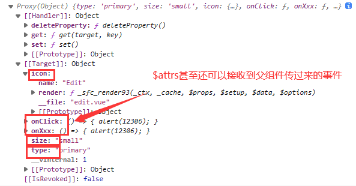
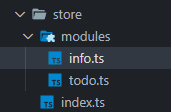

# vue3 组件通讯方式

> 学习小破站 vue3 组件通讯方式 的笔记

> 学习视频地址：https://www.bilibili.com/video/BV1Xh411V7b5?p=2

<details markdown="1">
  <summary>目录</summary>

- [vue3 组件通讯方式](#vue3-组件通讯方式)
  - [一、比较 vue2 的通讯方式](#一比较-vue2-的通讯方式)
  - [二、vue3 组件通讯方式](#二vue3-组件通讯方式)
    - [1.props](#1props)
    - [2.自定义事件](#2自定义事件)
      - [2.1 vue2 和 vue3 中的自定义事件和原生事件对比：](#21-vue2-和-vue3-中的自定义事件和原生事件对比)
      - [2.2 $emit 和 defineEmits](#22-emit-和-defineemits)
    - [3.全局事件总线$bus](#3全局事件总线bus)
    - [4.v-model](#4v-model)
    - [5.useAttrs](#5useattrs)
    - [6.ref 和 $parent](#6ref-和-parent)
    - [7.provide 与 inject](#7provide-与-inject)
    - [8.pinia](#8pinia)
    - [9.slot](#9slot)

</details>

## 一、比较 vue2 的通讯方式

`props`:可以实现父子组件、子父组件、甚至兄弟组件通信,props 数据还是只读的

`自定义事件`:可以实现子父组件通信

`全局事件总线` `$bus`:可以实现任意组件通信

`pubsub`:发布订阅模式实现任意组件通信

`vuex`:集中式状态管理容器，实现任意组件通信

`ref`:父组件获取子组件实例 VC,获取子组件的响应式数据以及方法

`slot`:插槽(默认插槽、具名插槽、作用域插槽)实现父子组件通信.......

## 二、vue3 组件通讯方式

vue3 中需要使用到 `defineProps` 方法去接受父组件传递过来的数据

### 1.props

```html
<template>
  <div class="son">
    <p>{{ props.money }}</p>
    <!--props可以省略前面的名字，只在html中适用，在js中要加props.xxx--->
    <p>{{ money }}</p>
  </div>
</template>

<script setup lang="ts">
  //defineProps是Vue3提供方法,不需要引入直接使用
  let props = defineProps(['money']) //数组|对象写法都可以

  //props 传入的值是 10000

  // props:只读的
  props.money += 10
  console.log(props.info) //10000
</script>
```

### 2.自定义事件

#### 2.1 vue2 和 vue3 中的自定义事件和原生事件对比：

```html
<div>
  <button @click="handler1(1,$event)">按钮</button>
  <Child1 @click="handle2(2,$event)" />
</div>
```

- `vue2` 框架当中，`@click`这种写法是`自定义事件`,可以通过`.native`修饰符变为`原生DOM事件`

- `vue3` 框架下面写法为`原生 DOM 事件`
  即在上面实例的`div内的任意位置`点击，都会触发 div 内标签绑定的`@click`方法

- `vue3` 原生的 DOM 事件不管是放在`标签`、`组件标签`身上都是`原生 DOM 事件`

#### 2.2 $emit 和 defineEmits

`vue2`中是使用`$emit`调用父组件方法：`this.$emit('fun',value)`

在`vue3`中`组合式api`写法中没有`this`，没有组件实例，不能使用`this.$emit`写法

`vue3`需要利用 `defineEmits` 方法返回函数触发`自定义事件`

```html
<!-- Child2.vue -->
<template>
  <div>
    <button @click="handler">自定义事件xxx</button>
    <button @click="$emit('click', 'a', 'b')">自定义事件click</button>
  </div>
</template>

<script setup lang="ts">
  //
  //defineEmits方法不需要引入直接使用
  let $emit = defineEmits(['xxx', 'click'])

  const handler = () => $emit('xxx', 'c', 'd')
</script>
```

**注意上面父组件传出了`click`方法，名字相同，vue3 就认为父组件的@click 是自定义事件**

```html
<!-- 父组件 -->
<div>
  <Child2 @xxx="handle3(3,$event)" @click="handle2(4,$event)" />
</div>
```

此时，点击 `div` 内`Child2`组件中绑定了`自定义事件`的标签才会触发

### 3.全局事件总线$bus

`全局事件总线`可以实现`任意组件通信`，在`vue2`中可以根据`VM`与`VC`关系推出全局事件总线。

但是在`vue3`中没有`Vue构造函数`，也就没有`Vue.prototype.`，vue3 的组合式 API 写法也没有`this`。

那么在 Vue3 想实现全局事件的总线功能就有点不现实。

如果想在 Vue3 中使用全局事件总线功能可以使用插件 mitt 实现。

mitt:官网地址: https://www.npmjs.com/package/mitt

**父组件 src/views/EventBus/EventBusTest**

```html
<template>
  <div class="box">
    <h1>全局事件总线$bus</h1>
    <hr />
    <div class="container">
      <Child1></Child1>
      <Child2></Child2>
    </div>
  </div>
</template>

<script setup lang="ts">
  //引入子组件
  import Child1 from './Child1.vue'
  import Child2 from './Child2.vue'
</script>
```

**子组件 src/views/EventBus/Child1**

```html
<template>
  <div class="child1">
    <h3>我是子组件1:曹植</h3>
  </div>
</template>

<script setup lang="ts">
  import $bus from '../../bus'
  //组合式API函数
  import { onMounted } from 'vue'
  //组件挂载完毕的时候,当前组件绑定一个事件,接受将来兄弟组件传递的数据
  onMounted(() => $bus.on('car', car => console.log(car)))
</script>
```

**子组件 src/views/EventBus/Child2**

```html
<template>
  <div class="child2">
    <h2>我是子组件2:曹丕</h2>
    <button @click="handler">点击我给兄弟送一台法拉利</button>
  </div>
</template>

<script setup lang="ts">
  //引入$bus对象
  import $bus from '../../bus'
  //点击按钮回调
  const handler = () => $bus.emit('car', { car: '法拉利' })
</script>
```

**src/bus/index.ts**

```ts
//引入mitt插件:mitt一个方法,方法执行会返回bus对象
import mitt from 'mitt'
const $bus = mitt()
export default $bus
```

### 4.v-model

（1）v-model 指令可是收集表单数据(`数据双向绑定`)

除此之外它也可以实现`父子组件数据同步`。

而 v-model 实指利用 `props['modelValue']`与自定义事件`update:modelValue`实现的。

下方代码:相当于给组件 Child 传递一个 `props(modelValue)`与绑定一个自定义事件 `update:modelValue` 实现父子组件数据同步

**父组件中**

```html
<child v-model="modelValue"></child>
```

**Child 子组件中**

```ts
<script setup lang="ts">
//接受props
let props = defineProps(['modelValue'])
let $emit = defineEmits(['update:modelValue'])
//触发自定义事件
const handler = () => $emit('update:modelValue', props.modelValue + 1000)
</script>
```

（2）在 vue3 中一个组件可以通过使用`多个 v-model`,让父子组件`多个数据同步`

下方代码相当于给组件 Child 传递两个 props

分别是 pageNo 与 pageSize，以及绑定两个自定义事件 `update:pageNo` 与 `update:pageSize` 实现父子数据同步

**父组件中**

```html
<Child1 v-model:pageNo="pageNo" v-model:pageSize="pageSize"></Child1>
```

**Child1 子组件中**

```ts
<script setup lang="ts">
let props = defineProps(["pageNo", "pageSize"]);
let $emit = defineEmits(["update:pageNo", "update:pageSize"]);
//第一个按钮的事件回调
const handler = () => $emit("update:pageNo", props.pageNo + 3);
const handler2 = () => $emit("update:pageSize", props.pageSize + 1);
</script>
```

### 5.useAttrs

vue3 框架提供一个方法 `useAttrs` 方法,它可以`获取组件身上的属性与事件`

注意： useAttrs 还可以获取接收到事件！<a href="#a" >点击查看 </a>

_父组件_

```html
<template>
  <div>
    <!-- 自定义组件 -->
    <HintButton
      type="primary"
      size="small"
      :icon="Edit"
      title="编辑按钮"
      @click="handler"
      @xxx="handler"
    ></HintButton>
  </div>
</template>

<script setup lang="ts">
  //图标组件
  import { Edit } from '@element-plus/icons-vue'
  import HintButton from './HintButton.vue'
  const handler = () => alert(12306)
</script>
```

**HintButton 子组件**

**注意**：`props`与`useAttrs`方法都可以获取父组件传递过来的属性与属性值，

但是`props`接受了的，`useAttrs`方法就获取不到了，`props`的优先级高

```html
<template>
  <div :title="title">
    <el-button :="$attrs"></el-button>
  </div>
</template>

<script setup lang="ts">
  // 引入 `useAttrs` 方法:获取当前`HintButton`组件标签身上属性与事件
  import { useAttrs } from 'vue'

  //此方法执行会返回一个对象
  let $attrs = useAttrs() //{type:'primary',size:'small',icon:Edit}

  //props接受了的，useAttrs方法就获取不到了
  let props = defineProps(['title'])
  console.log($attrs)
</script>
```

 <p id="a"> 在浏览器控制台$attrs的打印值：</p>



可以看到，`$attrs`不仅可以接受`属性和属性值`，`$attrs`甚至还可以接收到父组件传过来的`事件`

**子组件中`:="$attrs"`的解释**

```html
<el-button :="$attrs"></el-button>
```

可以简单理解为：

```html
<el-button v-bind="{type:'primary',size:'small',icon:Edit}"></el-button>
```

即给标签绑定三个属性：

```html
<el-button :type="primary" :size="small" :icon:Edit></el-button>
```

### 6.ref 和 $parent

**`ref`**:可以获取真实的 DOM 节点、获取到子组件实例 VC

**`$parent`**:可以在子组件内部获取到父组件的实例

**父组件**

```html
<template>
  <div class="box">
    <h1>我是父亲曹操:{{money}}</h1>
    <button @click="handler">找我的儿子曹植借10元</button>
    <hr />
    <Son ref="son"></Son>
    <hr />
    <Dau></Dau>
  </div>
</template>

<script setup lang="ts">
  //引入子组件
  import Son from './Son.vue'
  import Dau from './Daughter.vue'
  import { ref } from 'vue'
  //父组件钱数
  let money = ref(100000000)
  //获取子组件的实例
  let son = ref()
  //父组件内部按钮点击回调
  const handler = () => {
    money.value += 10
    //儿子钱数减去10
    son.value.money -= 10
    son.value.fly()
  }

  defineExpose({
    money,
  })
</script>
```

**组件内部数据对外关闭的，别人不能访问**

**如果想让外部访问需要通过 `defineExpose` 方法对外暴露**

```js
defineExpose({ money })
```

**Son 子组件**

```html
<template>
  <div class="son">
    <h3>我是子组件:曹植{{ money }}</h3>
  </div>
</template>

<script setup lang="ts">
  import { ref } from 'vue'
  //儿子钱数
  let money = ref(666)
  const fly = () => console.log('我可以飞')
  defineExpose({
    money,
    fly,
  })
</script>
```

**Daughter 子组件**

```html
<template>
  <div class="dau">
    <h1>我是闺女曹杰{{money}}</h1>
    <button @click="handler($parent)">点击我爸爸给我10000元</button>
  </div>
</template>

<script setup lang="ts">
  import { ref } from 'vue'
  //闺女钱数
  let money = ref(999999)
  //闺女按钮点击回调
  const handler = $parent => {
    money.value += 10000
    $parent.money -= 10000
  }
</script>
```

### 7.provide 与 inject

vue3 提供`provide(提供)`与`inject(注入)`,可以实现`隔辈组件传递数据`

例如祖辈组件中的的子组件的子组件可以使用祖辈组件提供的数据

**祖辈组件中**

```ts
<script setup lang="ts">
  import {(ref, provide)} from "vue"; let car = ref("法拉利");
  //祖先组件给后代组件提供数据 //两个参数:第一个参数就是提供的数据key
  //第二个参数:祖先组件提供数据 provide("TOKEN", car);
</script>
```

**后代组件中**

```ts
<script setup lang="ts">
import {inject} from 'vue';
//注入祖先组件提供数据
//需要参数:即为祖先提供数据的key
let car = inject('TOKEN');
const updateCar = ()=> (car.value = '自行车')

</script>

```

### 8.pinia

**集中式管理状态容器**

类似 vuex，都可以实现任意组件之间通信

- vuex:

  - 核心概念:`state、mutations、actions、getters、modules`

- pinia:
  - 核心概念:`state、actions、getters`
  - pinia 写法:选择器 API、组合式 API

**目录**



**index.ts**

```ts
//创建大仓库
import { createPinia } from 'pinia'
//createPinia方法可以用于创建大仓库
let store = createPinia()
//对外暴露,安装仓库
export default store
```

**info.ts**
定义 info 小仓库

```ts
import { defineStore } from 'pinia'
//第一个仓库:小仓库名字  第二个参数:小仓库配置对象
//defineStore方法执行会返回一个函数,函数作用就是让组件可以获取到仓库数据
let useInfoStore = defineStore('info', {
  //存储数据:state
  state: () => {
    return {
      count: 99,
      arr: [1, 2, 3, 4, 5, 6, 7, 8, 9, 10],
    }
  },
  actions: {
    //注意:函数没有context上下文对象
    //没有commit、没有mutations去修改数据
    updateNum(a: number, b: number) {
      this.count += a
    },
  },
  getters: {
    total() {
      let result: any = this.arr.reduce((prev: number, next: number) => {
        return prev + next
      }, 0)
      return result
    },
  },
})
//对外暴露方法
export default useInfoStore
```

**todo.ts**
定义组合式 API 仓库

```ts
import { defineStore } from 'pinia'
import { ref, computed, watch } from 'vue'
//创建小仓库
let useTodoStore = defineStore('todo', () => {
  let todos = ref([
    { id: 1, title: '吃饭' },
    { id: 2, title: '睡觉' },
    { id: 3, title: '打豆豆' },
  ])
  let arr = ref([1, 2, 3, 4, 5])

  const total = computed(() => {
    return arr.value.reduce((prev, next) => {
      return prev + next
    }, 0)
  })
  //务必要返回一个对象:属性与方法可以提供给组件使用
  return {
    todos,
    arr,
    total,
    updateTodo() {
      todos.value.push({ id: 4, title: '组合式API方法' })
    },
  }
})

export default useTodoStore
```

**在页面中**

```html
<template>
  <div class="child1">
    {{ infoStore.count }}
    <p @click="updateTodo">{{ todoStore.arr }}{{ todoStore.total }}</p>
  </div>
</template>

<script setup lang="ts">
  import useInfoStore from '../../store/modules/info'
  //获取小仓库对象
  let infoStore = useInfoStore()

  //引入组合式API函数仓库
  import useTodoStore from '../../store/modules/todo'
  let todoStore = useTodoStore()

  //点击p段落去修改仓库的数据
  const updateTodo = () => todoStore.updateTodo()
</script>
```

<!-- （1）选择器 API 写法

（2）组合式 API 写法 -->

### 9.slot

插槽:**`默认插槽、具名插槽、作用域插槽`**

（1）**`作用域插槽`**

就是可以传递数据的插槽,子组件可以讲数据回传给父组件,父组件可以决定这些回传的数据是以何种结构或者外观在子组件内部去展示！！！

**父组件中**

```html
<template>
  <div>
    <h1>slot</h1>
    <Test1 :todos="todos">
      <template v-slot="{ $row, $index }">
        <p :style="{ color: $row.done ? 'green' : 'red' }">
          {{ $row.title }}--{{ $index }}
        </p>
      </template>
    </Test1>
  </div>
</template>

<script setup lang="ts">
  import Test1 from './Test1.vue'

  import { ref } from 'vue'
  //todos数据
  let todos = ref([
    { id: 1, title: '吃饭', done: true },
    { id: 2, title: '睡觉', done: false },
    { id: 3, title: '打豆豆', done: true },
    { id: 4, title: '打游戏', done: false },
  ])
</script>
```

**Test1 子组件**

```html
<template>
  <div class="box">
    <h1>作用域插槽</h1>
    <ul>
      <li v-for="(item, index) in todos" :key="item.id">
        <!--作用域插槽:可以讲数据回传给父组件-->
        <slot :$row="item" :$index="index"></slot>
      </li>
    </ul>
  </div>
</template>

<script setup lang="ts">
  //通过props接受父组件传递数据
  defineProps(['todos'])
</script>
```

（2）默认插槽、具名插槽
**父组件中**

```html
<Test>
  <!-- 默认插槽 -->
  <div>
    <pre>大江东去浪淘尽,千古分流人物</pre>
  </div>
  <!-- 具名插槽填充a -->
  <template #a>
    <div>具名插槽a</div>
  </template>
  <!-- 具名插槽填充b v-slot指令可以简化为# -->
  <template #b>
    <div>具名插槽b</div>
  </template>
</Test>
```

**Test 子组件中**

```html
<template>
  <div class="box">
    <!-- 默认插槽 -->
    <slot></slot>
    <!-- 具名插槽 -->
    <slot name="a"></slot>
    <slot name="b"></slot>
  </div>
</template>

<script setup lang="ts"></script>
```
