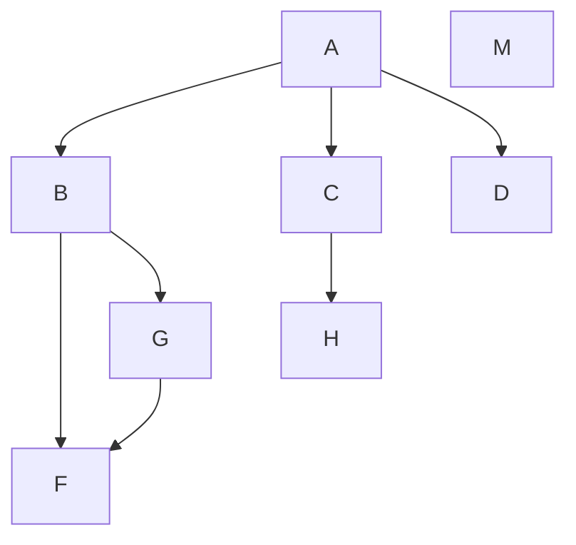
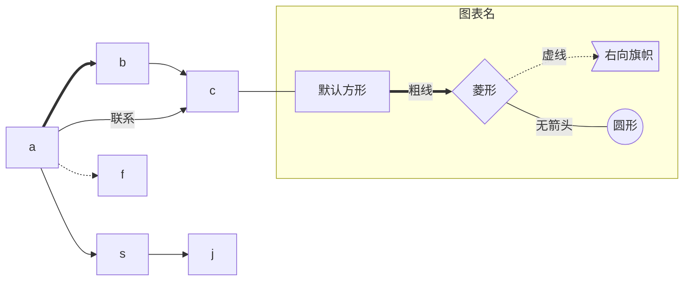
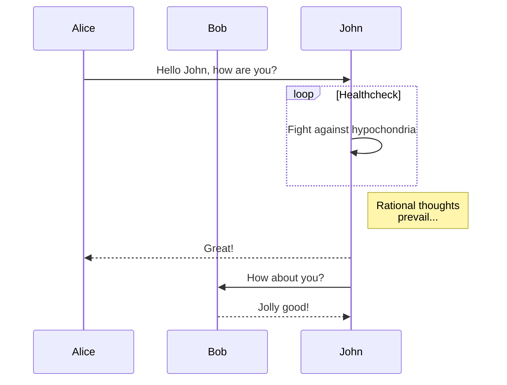
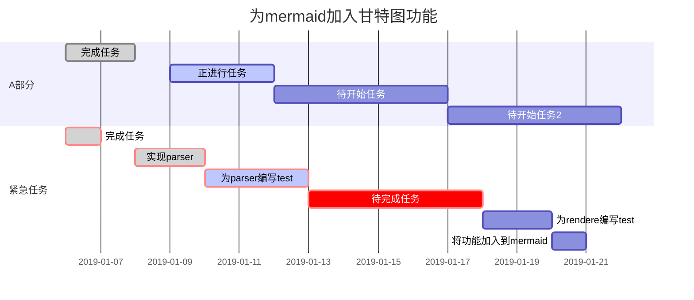

<details markdown="1">
  <summary>目录</summary>
</details>

**[TOC]标签生成目录**

[TOC]

手写链接

- [一级标题](#一级标题)
  - [二级标题](#二级标题)
  - [符号 转义符](#符号-转义符)

# 一级标题

Flowchart（流程图）
注意：

```
方向
符号	意义
TB	从上到下
BT	从下到上
RL	从右到左
LR	从左到右
图线
符号	意义
>	添加尾部箭头
-	不添加尾部箭头
--	单线
--text--	单线上加文字
==	粗线
==text==	粗线加文字
-.-	虚线
-.text.-	虚线加文字
节点
表述	说明
id[文字]	矩形节点
id(文字)	圆角矩形节点
id((文字))	圆形节点
id>文字]	右向旗帜状节点
id{文字}	菱形节点

```





Sequence diagram(顺序图)



甘特图(Gantt diagram)



## 二级标题

> 这里是区块

> 这里是区块
> 这里是区块

> 这里是嵌套区块
>
> > 这里是嵌套区块
> >
> > > 这里是嵌套区块

## 符号 转义符

< &#60;

>     &#62;

& &#38;

@ &#64;
