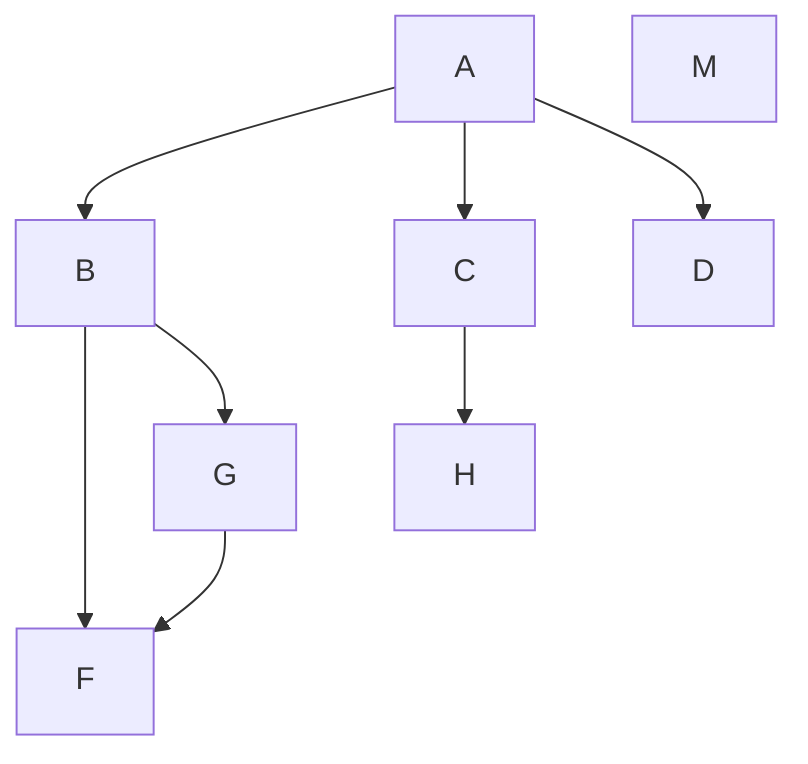

  
目录

- [vue 全家桶](#vue-全家桶)
  - [区块](#区块)

**[TOC]标签生成目录**

[TOC]

# 一级标题

- _https://www.bbsmax.com/A/x9J2QZlWz6/_

```mermaid
graph TD;
    A-->B;
    A-->C;
    A-->D;
    M;
    B-->F;
    B-->G;
    G-->F
    C-->H;
```

## 二级标题

> 这里是区块

> 这里是区块
> 这里是区块

> 这里是嵌套区块
>
> > 这里是嵌套区块
> >
> > > 这里是嵌套区块
