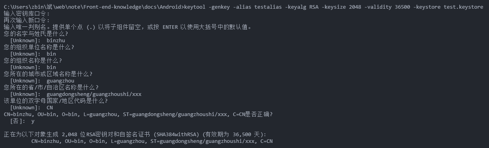
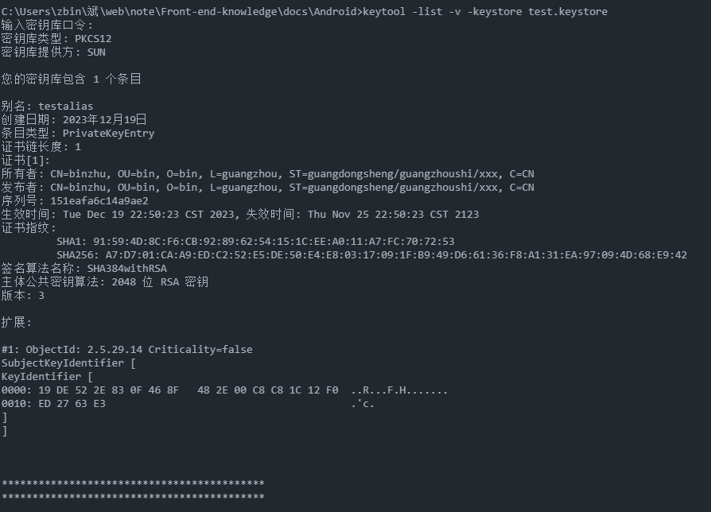

# 生成 Android 平台签名证书

## 生成签名证书

[Android 平台签名证书(.keystore)生成指南](https://ask.dcloud.net.cn/article/35777)

使用 keytool -genkey 命令生成证书：

```bash
keytool -genkey -alias testalias -keyalg RSA -keysize 2048 -validity 36500 -keystore test.keystore
```

- testalias 是证书别名，可修改为自己想设置的字符，建议使用英文字母和数字
- test.keystore 是证书文件名称，可修改为自己想设置的文件名称，也可以指定完整文件路径
- 36500 是证书的有效期，表示 100 年有效期，单位天，建议时间设置长一点，避免证书过期

回车后会提示：

```bash
Enter keystore password:  //输入证书文件密码，输入完成回车
Re-enter new password:   //再次输入证书文件密码，输入完成回车
What is your first and last name?
  [Unknown]:  //输入名字和姓氏，输入完成回车
What is the name of your organizational unit?
  [Unknown]:  //输入组织单位名称，输入完成回车
What is the name of your organization?
  [Unknown]:  //输入组织名称，输入完成回车
What is the name of your City or Locality?
  [Unknown]:  //输入城市或区域名称，输入完成回车
What is the name of your State or Province?
  [Unknown]:  //输入省/市/自治区名称，输入完成回车
What is the two-letter country code for this unit?
  [Unknown]:  //输入国家/地区代号（两个字母），中国为CN，输入完成回车
Is CN=XX, OU=XX, O=XX, L=XX, ST=XX, C=XX correct?
  [no]:  //确认上面输入的内容是否正确，输入y，回车

Enter key password for <testalias>
        (RETURN if same as keystore password):  //确认证书密码与证书文件密码一样（HBuilder|HBuilderX要求这两个密码一致），直接回车就可以
```



## 查看证书信息：

```bash
keytool -list -v -keystore test.keystore
```



其中证书指纹信息（Certificate fingerprints）：

- MD5

证书的 MD5 指纹信息（安全码 MD5）

- SHA1

证书的 SHA1 指纹信息（安全码 SHA1）

- SHA256

证书的 SHA256 指纹信息（安全码 SHA245）
